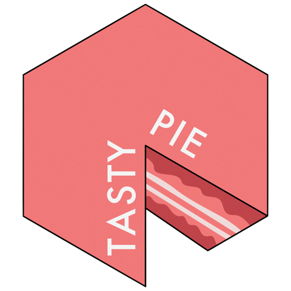

<!-- README.md is generated from README.Rmd. Please edit that file -->

# tastypie 

<!-- badges: start -->

[](https://CRAN.R-project.org/package=tastypie)
[](https://www.tidyverse.org/lifecycle/#experimental)
<!-- badges: end -->

You only need to type *“why pie charts are bad”* on
[Google](https://www.google.com/search?q=why+pie+charts+are+bad) to find
thousands of articles full of (very valid) reasons why this type of
chart should not be used.  
**However**, my mother, a high school teacher of Latin and Italian
literature, swears she understands more from something like this:


than from something like this:

<table>

<thead>

<tr>

<th style="text-align:left;">

InYourOpinion

</th>

<th style="text-align:right;">

value

</th>

</tr>

</thead>

<tbody>

<tr>

<td style="text-align:left;">

My mum

</td>

<td style="text-align:right;">

20

</td>

</tr>

<tr>

<td style="text-align:left;">

Is

</td>

<td style="text-align:right;">

30

</td>

</tr>

<tr>

<td style="text-align:left;">

Strange?

</td>

<td style="text-align:right;">

50

</td>

</tr>

</tbody>

</table>

Now, I love my mum, and I want her to be happy. Maybe there are other
people in the world with this *particular problem*, so, why not help?  
Due to the little use due to the reasons that have already been
presented, making pie charts in R is not immediate, so it is necessary
to create functions to simplify things.

In this R package there are useful functions for making **tasty pies**
facilitating the use of functions already present in
[ggplot2](https://ggplot2.tidyverse.org/).

## Installation

You can install the development version from
[GitHub](https://github.com/) with:

``` r
# install.packages("devtools")
devtools::install_github("PaoloDalena/tastypie")
```

## Example

This is a basic example which shows you how to solve a common problem:

``` r
library(tastypie)
## basic example code
```
