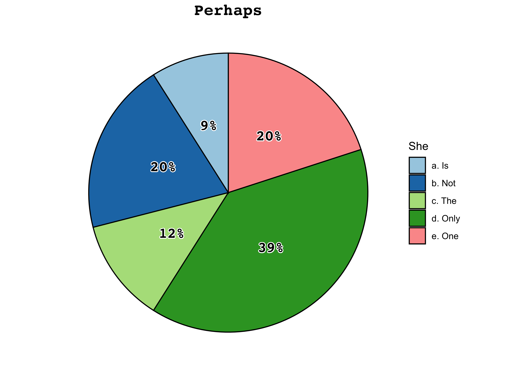
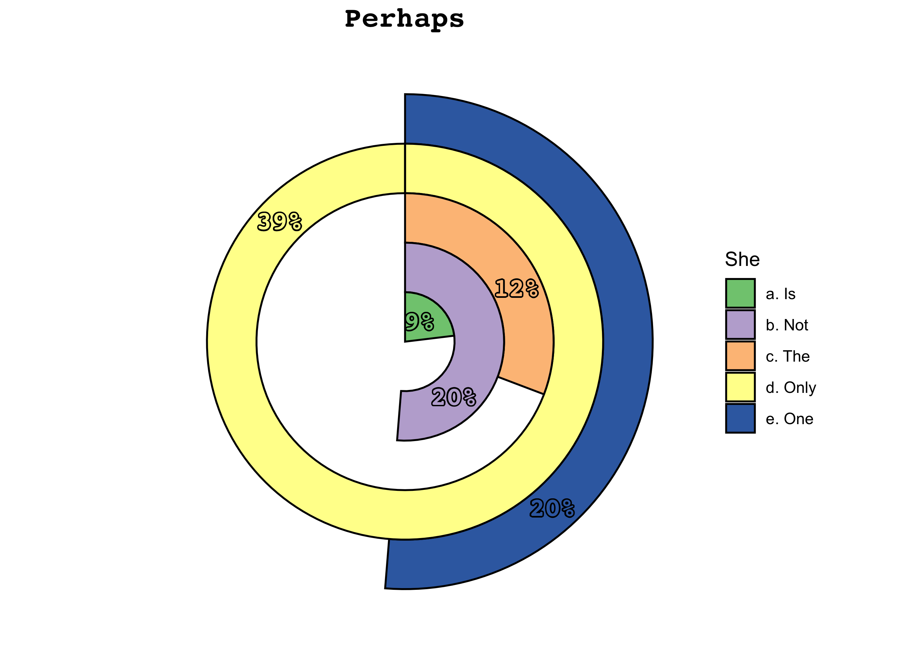

<!-- README.md is generated from README.Rmd. Please edit that file -->

# tastypie [](https://paolodalena.github.io/tastypie/) 

<!-- badges: start -->

[](https://CRAN.R-project.org/package=tastypie)
[](https://lifecycle.r-lib.org/articles/stages.html)
[](https://github.com/PaoloDalena/tastypie)
[](https://cran.r-project.org/web/licenses/GPL-3)
[](https://github.com/PaoloDalena/tastypie)
[](https://github.com/PaoloDalena/tastypie/actions)
<!-- badges: end -->

  - Add figures to the pie charts, easily create circular packing
    charts, radar charts and circular barplots: **check out what’s new
    in `{tastypie}` `0.1.0`**
    [here](https://paolodalena.github.io/tastypie/news/index.html)\!
  - Would you like to **join the `{tastypie}` crew and get a free
    `tasty_tshirt`**? Find out the details
    [here](https://paolodalena.github.io/tastypie/articles/tasty_tshirts.html).

You only need to type *“why pie charts are bad”* on
[Google](https://www.google.com/search?q=why+pie+charts+are+bad) to find
thousands of articles full of (very valid) reasons why this type of
chart should not be used.  
[However](https://github.com/PaoloDalena/tastypie/blob/main/meme.jpeg),
my mother, a high school teacher of Latin and Italian Literature, swears
she understands more from something like this:


than from something like this:

<table>

<thead>

<tr>

<th style="text-align:left;">

InYourOpinion

</th>

<th style="text-align:right;">

Value

</th>

<th style="text-align:right;">

Proportion

</th>

</tr>

</thead>

<tbody>

<tr>

<td style="text-align:left;">

My mum

</td>

<td style="text-align:right;">

60

</td>

<td style="text-align:right;">

0.2

</td>

</tr>

<tr>

<td style="text-align:left;">

Is

</td>

<td style="text-align:right;">

90

</td>

<td style="text-align:right;">

0.3

</td>

</tr>

<tr>

<td style="text-align:left;">

Strange?

</td>

<td style="text-align:right;">

150

</td>

<td style="text-align:right;">

0.5

</td>

</tr>

</tbody>

</table>

Now, I love my mum, and I want her to be happy. Maybe there are other
people in the world with this *particular problem*, so, why not help?  
Due to the little use because of the already mentioned reasons, making
pie (and related) charts in R is not straightforward, so it is necessary
to have functions to simplify things.

In this R package there are useful functions for making **tasty pies**
exploiting some [ggplot2](https://ggplot2.tidyverse.org/) features.

## Installation

You can install the released version of `{tastypie}` from
[CRAN](https://CRAN.R-project.org) with:

``` r
install.packages("tastypie")
```

Or, you can install the development version from
[GitHub](https://github.com/) with:

``` r
# install.packages("devtools")
devtools::install_github("PaoloDalena/tastypie")
```

Then, you can attach to your session with:

``` r
library(tastypie)
#>             $$  $$  $$
#>           __||__||__||__
#>          | * * * * * * *|
#>          |* * * * * * * |
#>          | * * * * * * *|
#>          |______________|
#>  _              _              _
#> | |_  ___  ___ | |_  _ _  ___ |_| ___
#> |  _|| .'||_ -||  _|| | || . || || -_|
#> |_|  |__,||___||_|  |_  ||  _||_||___|
#>                     |___||_|
```

## Usage

**`{tastypie}`** allows the user to easily create many different pie
charts based on different templates.

Using **`pie_bake()`** you just have to choose a template and if you
want the proportions to be displayed in the plot or not (if you want,
you can also set a title and a group name):

``` r
example <- data.frame(
  c("a. Is", "b. Not", "c. The", "d. Only", "e. One"),
  c(2.9, 6.9, 4.20, 13.12, 6.66)
)

pie_bake(data = example, template = "basic4", perc = TRUE,
         title = "Perhaps", group_name = "She")
```



``` r
pie_bake(data = example, template = "red1", perc = TRUE,
         title = "Perhaps", group_name = "She")
```


Or, if you want something more extravagant (*but probably less
understandable*), choose a template and try **`pie_bake_pro()`**:

``` r
pie_bake_pro(data = example, template = "dart5",
             title = "Perhaps", group_name = "She")
```



``` r
pie_bake_pro(data = example, template = "cirbar3", title = "Perhaps she")
```


Or, if you are interested in a circular packing chart, you can easily do
it with the **`bubble_blow`** function:

``` r
exblow <- data.frame(
  LETTERS[1:8],
  c(33, 24, 54, 12, 43, 88, 66, 78)
)
bubble_blow(exblow, template = "bub2", perc = "below", title = "Easy bubbles:")
```


Not sure which template to choose? Run **`pie_discover()`** to find out
a random combination of templates, number of groups and features and get
an idea of the many available plots:

``` r
pie_discover()
```


Want to display an example of a particular template with particular
features? Try **`pie_templates()`**:

``` r
pie_templates("eaten4", n_groups = 9)
```


Do you want a list of all the available templates? Check the
**`pie_template_list`** and the **`pie_template_list_pro`** vectors\!

``` r
pie_template_list # to be used with pie_bake()
#>  [1] "basic1"   "basic2"   "basic3"   "basic4"   "basic5"   "bw1"     
#>  [7] "bw2"      "bw3"      "bw4"      "bw5"      "blue1"    "blue2"   
#> [13] "blue3"    "blue4"    "blue5"    "red1"     "red2"     "red3"    
#> [19] "red4"     "red5"     "rainbow1" "rainbow2" "rainbow3" "rainbow4"
#> [25] "rainbow5" "donut1"   "donut2"   "donut3"   "donut4"   "donut5"

pie_template_list_pro # to be used with pie_bake_pro()
#>  [1] "eaten1"      "eaten2"      "eaten3"      "eaten4"      "eaten5"     
#>  [6] "dart1"       "dart2"       "dart3"       "dart4"       "dart5"      
#> [11] "eye1"        "eye2"        "eye3"        "eye4"        "eye5"       
#> [16] "watermelon1" "watermelon2" "watermelon3" "watermelon4" "watermelon5"
#> [21] "cirbar1"     "cirbar2"     "cirbar3"     "cirbar4"     "cirbar5"    
#> [26] "spider1"     "spider2"     "spider3"     "spider4"     "spider5"
```

Do you want to see all possible templates displayed?
[Here](https://paolodalena.github.io/tastypie/articles/available_templates.html)
you can find what you are looking for.

Do you want to add some images to your tasty pie chart? You can do it
easily with **`pie_addimages()`**\! Check out an example of how to do it
[here](https://paolodalena.github.io/tastypie/articles/available_templates.html#example-of-usage-of-pie-addimages-).

**Be curious, there are many tasty pies\!**

## Feature request

If you need some more features, please tell me
[here](https://github.com/PaoloDalena/tastypie/issues).

## Bug reports

If you encounter a bug, please file a
[reprex](https://github.com/tidyverse/reprex) (minimal reproducible
example) [here](https://github.com/PaoloDalena/tastypie/issues).
